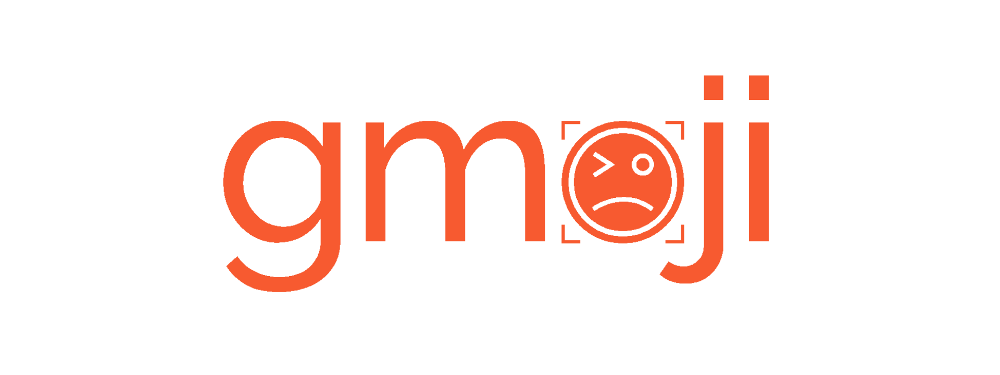

<p align="center">
  <a href="https://github.com/skmatz/gmoji">
    
  </a>
</p>

<p align="center">
  <a href="./LICENSE">
    
  </a>
  <a href="./go.mod">
    
  </a>
</p>

**Go implementation of [gitmoji](https://github.com/carloscuesta/gitmoji)**

[gitmoji](https://github.com/carloscuesta/gitmoji) is an emoji guide for commit messages.  
This repository is a Go implementation of [gitmoji-cli](https://github.com/carloscuesta/gitmoji-cli), a CLI application of [gitmoji](https://github.com/carloscuesta/gitmoji).  
This application does not require the Node.js environment and is fast enough as compared to the original, which is a JavaScript implementation.

## Usage

```sh
> gmoji help
```

```console
gmoji is the Go Implementation of gitmoji.

Usage:
  gmoji [flags]
  gmoji [command]

Available Commands:
  copy        Copy commit message to clipboard
  help        Help about any command
  hook        Set commit hook
  init        Download the list of gmojis
  list        Show the list of gmojis
  version     Show version

Flags:
  -h, --help          help for gmoji
      --hook string   hook path (.git/COMMIT_EDITMSG)

Use "gmoji [command] --help" for more information about a command.
```

### Basic Usage

```sh
# Download the list of gmojis for the first time only.
gmoji init

# After initializing git project, set commit hook.
git init
gmoji hook

# Add the file, commit it, and gmoji runs up automatically.
git add .
git commit
```
